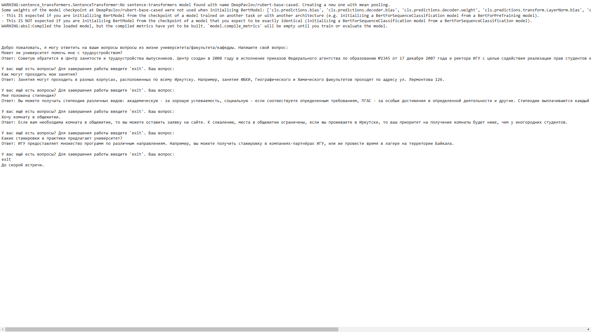

# Обучение чатбота

Чатбот обучен на основе нейронной сети RuBert и небольшой базы вопросов об университете/кафедре/факультете.

# Работа с чат ботом.

- Если у вас отсутствует модель или файл поврежден, запустите тренировку чатбота [train_ai.py](train_ai.py).
- Запустите чатбота [chatbot.py](chatbot.py) и задавайте свои вопросы.

# Результат работы

# Установка

Установите зависимости `requirements.txt`

`pip install requirements.txt`
